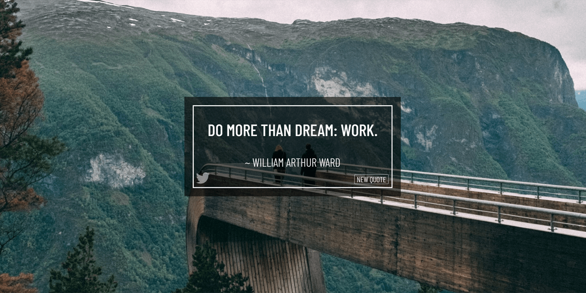

# Random Quote Machine
**Self-study React Project**

### About

Random Quote Machine built on React as a part of a [FreeCodeCamp](https://www.freecodecamp.org/) challenge.
* Current live version at https://cat-street.github.io/random-quote-machine/

### Technologies used

* JavaScript ES6 syntax, CSS3 + semantic HTML5
* Responsive layout
* React library, functional components
* Redux used for managing state
* JavaScript fetch for requesting quotes from server API
* Random backgrounds from [Unsplash](https://unsplash.com/)
* Share to Twitter button
